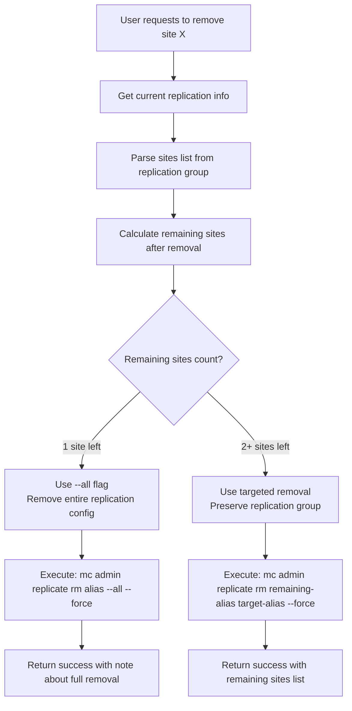

# Technical Specification: Smart Site Removal Logic

## Overview

This document details the intelligent site removal algorithm implemented in MC-Tool that preserves replication groups when removing individual sites from MinIO site replication.

## Problem Statement

**Original Issue**: When removing a site from MinIO replication using standard `mc admin replicate rm`, the entire replication configuration was destroyed, affecting all remaining sites.

**Required Solution**: Remove individual sites while preserving the replication group for remaining sites.

## Smart Removal Algorithm

### Algorithm Flow



### Implementation Details

#### 1. Information Gathering Phase

```go
// Get replication info to find remaining sites
replicateInfoCmd := exec.Command("mc", "admin", "replicate", "info", req.Alias, "--json")
infoOutput, infoErr := replicateInfoCmd.CombinedOutput()

if infoErr != nil {
    return error("Failed to get replication info")
}

var replicateInfo map[string]interface{}
json.Unmarshal(infoOutput, &replicateInfo)
```

#### 2. Sites Analysis Phase

```go
// Parse sites list and identify remaining sites
var remainingSites []string
if sitesList, ok := replicateInfo["sites"].([]interface{}); ok {
    for _, site := range sitesList {
        if siteMap, ok := site.(map[string]interface{}); ok {
            if siteName, ok := siteMap["name"].(string); ok && siteName != req.Alias {
                remainingSites = append(remainingSites, siteName)
            }
        }
    }
}
```

#### 3. Decision Logic Phase

```go
// Decision tree based on remaining sites count
if len(remainingSites) == 0 {
    return error("No other sites found in replication group")
}

if len(remainingSites) == 1 {
    // Only 2 sites total (target + 1 remaining)
    // Remove entire replication configuration
    cmd := exec.Command("mc", "admin", "replicate", "rm", req.Alias, "--all", "--force")
    
    response := {
        "message": "Site replication configuration removed successfully",
        "note": "This was the last replication pair. Entire replication configuration has been removed."
    }
} else {
    // 3+ sites total (target + 2+ remaining)  
    // Remove specific site while preserving group
    remainingAlias := remainingSites[0]
    cmd := exec.Command("mc", "admin", "replicate", "rm", remainingAlias, req.Alias, "--force")
    
    response := {
        "message": fmt.Sprintf("Site '%s' removed from replication successfully", req.Alias),
        "note": fmt.Sprintf("Remaining sites in replication group: %s", strings.Join(remainingSites, ", "))
    }
}
```

## Command Variations

### Scenario 1: Remove Entire Configuration (2 sites total)

**When**: Only 2 sites exist in replication group
**Command**: `mc admin replicate rm <alias> --all --force`
**Result**: Complete replication configuration removal
**Use Case**: User wants to disable replication entirely

### Scenario 2: Remove Individual Site (3+ sites total)

**When**: 3 or more sites exist in replication group  
**Command**: `mc admin replicate rm <remaining-alias> <target-alias> --force`
**Result**: Target site removed, replication continues with remaining sites
**Use Case**: Scaling down while maintaining replication

## Edge Cases Handling

### 1. No Remaining Sites
```go
if len(remainingSites) == 0 {
    s.respondError(w, http.StatusBadRequest, "No other sites found in replication group")
    return
}
```

### 2. Failed to Get Replication Info
```go
if infoErr != nil {
    logger.GetLogger().Error("Failed to get replication info", map[string]interface{}{
        "error":  infoErr.Error(),
        "output": string(infoOutput),
    })
    s.respondError(w, http.StatusInternalServerError, fmt.Sprintf("Failed to get replication info: %s", string(infoOutput)))
    return
}
```

### 3. Invalid JSON Response
```go
if err := json.Unmarshal(infoOutput, &replicateInfo); err != nil {
    logger.GetLogger().Error("Failed to parse replication info", map[string]interface{}{
        "error": err.Error(),
    })
    s.respondError(w, http.StatusInternalServerError, "Failed to parse replication info")
    return
}
```

## Testing Scenarios

### Test Case 1: 4-Site Group Removal
- **Initial State**: sites [site3, site4, site5, site6]
- **Action**: Remove site6
- **Expected**: sites [site3, site4, site5] remain in replication
- **Command Used**: `mc admin replicate rm site3 site6 --force`

### Test Case 2: 2-Site Group Removal  
- **Initial State**: sites [site1, site2]
- **Action**: Remove site2
- **Expected**: Complete replication removal
- **Command Used**: `mc admin replicate rm site2 --all --force`

### Test Case 3: Large Group Removal
- **Initial State**: sites [s1, s2, s3, s4, s5, s6, s7, s8]
- **Action**: Remove s5
- **Expected**: sites [s1, s2, s3, s4, s6, s7, s8] remain in replication
- **Command Used**: `mc admin replicate rm s1 s5 --force`

## API Response Format

### Successful Individual Removal
```json
{
    "success": true,
    "message": "Site 'site6' removed from replication successfully",
    "output": "Following site(s) [site6] were removed successfully\n",
    "note": "Remaining sites in replication group: site3, site4, site5"
}
```

### Successful Complete Removal
```json
{
    "success": true,
    "message": "Site replication configuration removed successfully", 
    "output": "Replication configuration removed\n",
    "note": "This was the last replication pair. Entire replication configuration has been removed."
}
```

### Error Response
```json
{
    "error": "Failed to remove site replication: <detailed error message>"
}
```

## Logging Strategy

### Information Logging
```go
logger.GetLogger().Info("Removing site from replication", map[string]interface{}{
    "alias": req.Alias,
})
```

### Success Logging
```go
logger.GetLogger().Info("Site removed from replication successfully", map[string]interface{}{
    "alias":          req.Alias,
    "remainingAlias": remainingAlias,
    "output":         string(output),
    "remainingSites": len(remainingSites),
})
```

### Error Logging
```go
logger.GetLogger().Error("Failed to remove site from replication", map[string]interface{}{
    "error":          err.Error(),
    "output":         string(output),
    "remainingAlias": remainingAlias,
    "targetAlias":    req.Alias,
})
```

## Performance Considerations

### Command Execution Time
- **Info Command**: ~100-500ms (depends on network latency)
- **Remove Command**: ~200ms-2s (depends on replication group size)
- **Total Operation**: ~500ms-3s typical

### Network Requirements
- All sites must be accessible during removal operation
- Command executed from any site in the replication group
- Requires admin privileges on MinIO instances

## Security Considerations

### Authentication
- Uses configured MC aliases with admin credentials
- Inherits MinIO authentication mechanism
- No additional authentication layer required

### Authorization
- Requires admin privileges on MinIO instances
- Operation affects entire replication group
- Audit logging for all operations

## Future Enhancements

### 1. Batch Removal
Support for removing multiple sites in single operation:
```json
{
    "aliases": ["site3", "site4"]
}
```

### 2. Validation Before Removal
Pre-flight checks before executing removal:
- Verify site connectivity
- Check replication health
- Validate remaining group viability

### 3. Rollback Capability
Ability to restore removed sites:
- Store removal history
- Provide rollback API
- Automatic rollback on failure

## Conclusion

The smart removal logic successfully addresses the original requirement of preserving replication groups when removing individual sites. The implementation provides:

1. **Intelligent Decision Making**: Automatically chooses appropriate removal strategy
2. **Data Preservation**: Maintains replication for remaining sites  
3. **User Feedback**: Clear messaging about operation results
4. **Error Handling**: Comprehensive error detection and reporting
5. **Logging**: Detailed operation tracking for debugging

This solution enables users to dynamically scale their replication groups without losing data integrity or requiring complete reconfiguration.